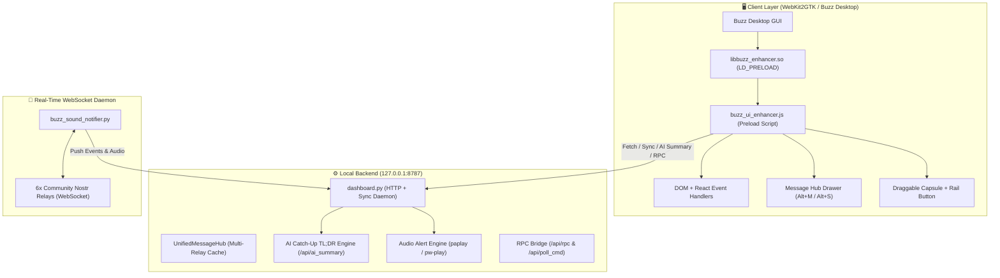

# ⚡ Buzz Desktop Ecosystem & AI Usage Center (Enterprise Suite)

[](#)
[](#)
[](#)
[](#)
[](#)

> **Hệ sinh thái mở rộng toàn diện cho Buzz Desktop (Linux/WebKit2GTK)** kết hợp **Trung tâm Giám sát Tài nguyên AI (AI Usage Center)**. Được thiết kế theo nguyên tắc phi xâm lấn (Non-invasive LD_PRELOAD), chuẩn hóa giao diện phong cách Raycast / Linear / Obsidian Glassmorphic, bản địa hóa 100% tiếng Việt tự nhiên và hỗ trợ triển khai 1 lệnh duy nhất trên mọi máy tính Linux.

---

## 🚀 Cài đặt Nhanh 1 Lệnh (Turnkey 1-Command Quickstart)

Dành cho bất kỳ máy tính nào đã cài ứng dụng **Buzz Desktop**:

```bash
# 1. Clone repository về máy
git clone https://github.com/thangngny/buzz-ai-usage-center.git
cd buzz-ai-usage-center

# 2. Chạy script cài đặt tự động (không cần quyền root/sudo)
./install.sh
```

Script `install.sh` sẽ tự động thực hiện:
1. Kiểm tra môi trường (Python 3, PulseAudio/PipeWire).
2. Tạo các thư mục cấu hình và cache trong `$HOME/.local/share/xyz.block.buzz.app`.
3. Biên dịch thư viện Injector `libbuzz_enhancer.so` từ mã nguồn C (sử dụng dynamic `$HOME`).
4. Thiết lập launcher wrapper `buzz-desktop` phi xâm lấn qua cơ chế `LD_PRELOAD`.
5. Cài đặt các file âm thanh (`sounds/`), kịch bản giao diện (`buzz_ui_enhancer.js`), daemon thông báo WebSocket (`buzz_sound_notifier.py`) và công cụ CLI `buzz-sound`.
6. Tự động cấu hình và kích hoạt 2 dịch vụ nền: `buzz-usage-dashboard.service` và `buzz-sound-notifier.service`.

> **Khởi chạy ứng dụng:** Chỉ cần mở ứng dụng Buzz Desktop bình thường hoặc gõ `buzz-desktop` trong Terminal.

---

## ✨ Các Tính Năng Nâng Cấp Nổi Bật (Key Features)

### 1. ⚡ Hộp Thư Nhanh Đa Nhóm (Glassmorphic Message Hub Drawer)
- **Phím tắt toàn cục:** Bấm **`Alt + M`** (hoặc click nút viên thuốc ở góc phải dưới / nút icon ⚡ trên thanh Rail) để mở ngay Hộp thư tin nhắn từ tất cả các nhóm & kênh.
- **Mặc định sạch sẽ (`🔴 Chưa xem`):** Chỉ hiển thị các tin nhắn mới chưa đọc, không gây rối mắt với số tổng 900+ tin lịch sử. Khi đã đọc hết sẽ hiện màn hình thông báo hoàn tất chúc mừng.
- **Tìm kiếm tức thì (`/`):** Tìm kiếm siêu tốc người gửi, nội dung tin nhắn, kênh, thư mục dự án với độ trễ 0ms.
- **Lọc theo loại tin:** Lọc nhanh theo *Tất cả*, *Kênh chat*, *Dự án & Thư mục*, *Tin riêng (DM)*, *Diễn đàn*.
- **Chuyển nhóm 1-9:** Bấm phím số `1` đến `9` để đổi nhanh bộ lọc giữa các Workspace (`dukickk`, `platogroup`, `ncthang04`, `ode`, `phamgianam`, `phuongstory`).

### 2. ⚡ AI Catch-Up TL;DR (Tóm Tắt Nhanh Tin Tồn Đọng)
- Bấm nút **`⚡ Tóm tắt AI`** trong Hộp thư hoặc nhấn **`Alt + S`**.
- Backend tự động gom các tin chưa đọc theo từng Cộng đồng & Kênh, liệt kê những ai vừa nhắn và trích xuất nội dung ngắn gọn giúp nắm bắt diễn biến trong 3 giây.
- Bấm vào bất kỳ thẻ tóm tắt nào để nhảy ngay đến đúng tin nhắn đó trong kênh.

### 3. 💬 Quick Reply & Action Chips (Trả Lời Nhanh 1 Chạm)
- Trực tiếp trên mỗi thẻ tin nhắn trong Drawer, bấm **`💬 Trả lời nhanh`** để mở ô phản hồi tức thì.
- Trang bị sẵn các chip hành động thông dụng:
  - `👍 OK`
  - `✅ Đã duyệt`
  - `🔄 Tiếp tục đi`
  - `⏳ Chờ chút nhé`
- Bấm vào chip hoặc nhập nội dung rồi bấm **Enter**, hệ thống tự động mở kênh và điền sẵn câu trả lời vào khung chat.

### 4. 🔔 Thông Báo Âm Thanh & Visual Real-Time Cho TẤT CẢ Tin Nhắn
- Notifier kết nối song song thời gian thực tới toàn bộ các Relay cộng đồng qua WebSocket Nostr NIP-42.
- **Mọi tin nhắn mới:** Đều kích hoạt âm báo `sound_message` và hiển thị thẻ thông báo nổi (In-app Toast) ở góc phải màn hình.
- **Tin nhắn riêng hoặc Mention (`@ncthang`...):** Phát âm báo VIP chuông ngân `sound_mention`.
- Tự động lọc sạch bot payloads, tin benchmark và tin nhắn do chính bạn gửi.

### 5. 👁️ Active Viewport Auto-Read (Tự Động Đọc Thông Minh)
- Theo dõi kênh thực tế đang hiển thị trên màn hình qua LocalStorage WebKit.
- Khi bạn dừng lại xem một kênh trên **2.2 giây**, hệ thống tự động ghi nhận bạn đã xem và xóa số đếm chưa đọc trên thanh tiện ích mà không cần bấm nút thủ công.

### 6. 🎯 Message Ping & Spotlight Aura (Định Vị Tin Nhắn Chính Xác)
- Khi bấm vào tin nhắn từ Drawer, hệ thống tự động chuyển Workspace, mở thư mục Accordion cha, nhấp vào kênh con, cuộn mượt đến đúng vị trí tin nhắn và làm nổi bật với:
  - Viền phát sáng nhịp thở Amber Neon (`buzz-spotlight-active`).
  - Huy hiệu tiêu điểm nổi `🎯 TIN NHẮN ĐÃ CHỌN`.
  - Mũi tên chỉ điểm động `👉`.
  - Bôi màu text dạ quang (`<mark class="buzz-ping-text-mark">`).

---

## 🏛️ Kiến Trúc Hệ Thống (Architecture)



---

## ⌨️ Bảng Phím Tắt Tiện Dụng (Keyboard Shortcuts)

| Phím tắt | Chức năng |
| :--- | :--- |
| <kbd>Alt</kbd> + <kbd>M</kbd> | Bật / tắt Hộp thư nhanh đa nhóm (Message Hub Drawer) |
| <kbd>Alt</kbd> + <kbd>S</kbd> | Tạo và hiển thị Tóm tắt AI tức thì (AI Catch-Up TL;DR) |
| <kbd>↑</kbd> / <kbd>↓</kbd> | Di chuyển chọn tin nhắn trong danh sách |
| <kbd>Enter</kbd> | Mở trực tiếp chuyên mục / kênh / tin nhắn đang chọn |
| <kbd>1</kbd> – <kbd>9</kbd> | Chuyển nhanh bộ lọc giữa các Workspace |
| <kbd>/</kbd> | Focus tức thì vào ô tìm kiếm tin nhắn |
| <kbd>Esc</kbd> | Đóng nhanh Drawer hoặc xóa hiệu ứng làm nổi bật tin nhắn |

---

## 🔊 Quản Trị Âm Thanh Bằng CLI (`buzz-sound`)

```bash
# Kiểm tra trạng thái âm thanh và service
buzz-sound status

# Phát thử âm thanh mặc định
buzz-sound test

# Phát thử giọng đọc hoặc chuông dễ thương
buzz-sound test elevenlabs
buzz-sound set-sound thang-cute

# Xem lịch sử 20 tin nhắn gần nhất kèm người gửi & thời gian
buzz-sound history
```

---

## 🔄 Gỡ Bỏ Cài Đặt (Uninstall)

Nếu muốn khôi phục Buzz Desktop về trạng thái nguyên bản:

```bash
./uninstall.sh
```

---

## 📄 Bản Quyền & Tác Giả

Phát triển cho **Buzz AI Ecosystem** bởi **NcThang** (`thangngny`).  
Bảo lưu mọi quyền © 2026.
