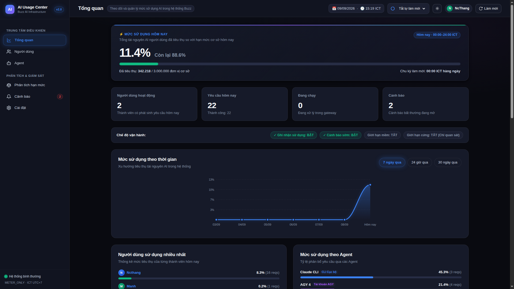
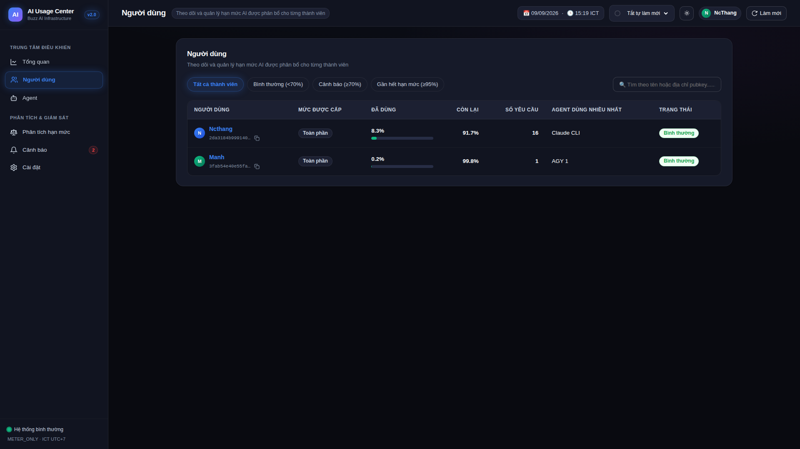
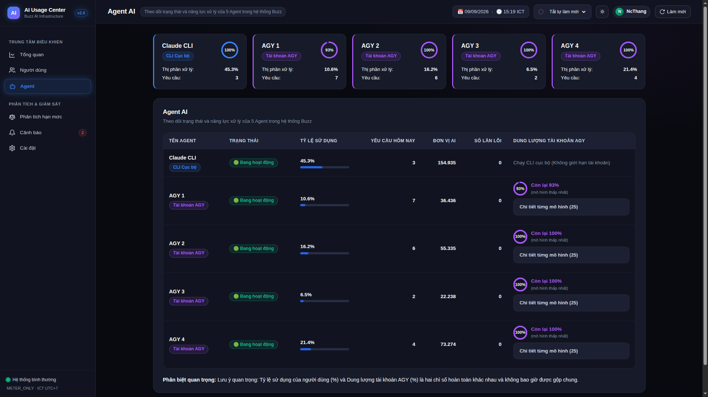
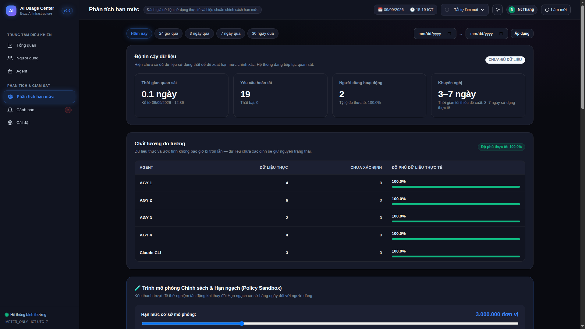
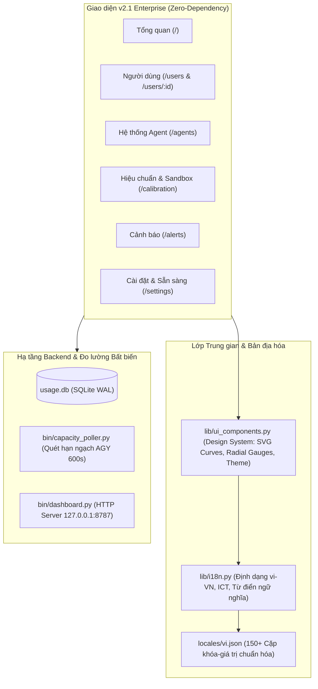

# ⚡ AI Usage Center — Buzz AI Infrastructure (v2.1 Enterprise)

[](#)
[](#)
[](#)
[](#)
[](#)

> **Trung tâm Giám sát & Phân bổ Tài nguyên AI (AI Usage Center)** dành cho hệ sinh thái Buzz đa tác tử (Claude CLI + 4 Cổng Google AGY). Được thiết kế theo chuẩn Enterprise SaaS cao cấp (Linear / Stripe / Vercel / Raycast), bản địa hóa 100% tiếng Việt tự nhiên và tối ưu hóa tối đa hiệu năng với frontend không phụ thuộc thư viện ngoài (Zero-JS/CSS dependencies).

---

## 📸 Giao diện Doanh nghiệp (Enterprise UI/UX)

| Tổng quan Hệ thống (Overview) | Danh sách Người dùng (Users & Search) |
| :---: | :---: |
|  |  |

| Giám sát Agent & Cổng kết nối (Agents) | Phân tích Hiệu chuẩn & Sandbox (Calibration) |
| :---: | :---: |
|  |  |

---

## ✨ Tính năng Nổi bật (Key Features)

### 1. 🎨 Thiết kế Obsidian Dark Mode & Bộ chuyển đổi Sáng/Tối (Theme Switcher)
- **Giao diện Tối Obsidian:** Sử dụng bảng màu tối sâu (`#090a10`, `#111420`, `#161a29`) kết hợp ánh sáng radial ambient mờ và thẻ kính mờ (`backdrop-filter: blur(16px)`).
- **Chuyển đổi Sáng ☀️ / Tối 🌙:** Chuyển đổi theme tức thì không tải lại trang và tự động lưu tùy chọn vào `localStorage`.

### 2. 📊 Trực quan hóa Dữ liệu SVG Mượt mà (Advanced SVG Visualizations)
- **Đường cong Bezier mượt mà (Cubic Bezier Curve):** Biểu đồ xu hướng sử dụng 7 ngày được vẽ bằng thuật toán Bezier cubic mượt mà, dải màu gradient mờ và hiệu ứng phát sáng neon.
- **Đồng hồ tròn Radial Gauge:** Vòng tròn tiến độ mini cho từng tài khoản AGY và hạn mức cơ sở.

### 3. 🔍 Bộ công cụ tương tác thông minh (Client-side Power Tools)
- **Tìm kiếm tức thì (Live Search):** Lọc người dùng theo tên hoặc PubKey theo thời gian thực (real-time keypress) không cần reload.
- **Sắp xếp cột bảng dữ liệu (Sortable Columns):** Nhấp tiêu đề cột để sắp xếp tăng/giảm theo % sử dụng, token, số request.
- **Sao chép 1-Click kèm Toast:** Copy mọi PubKey, Request ID, lệnh hệ thống kèm thông báo nổi *"✓ Đã sao chép"*.
- **Tự động làm mới (Auto-Refresh):** Tùy chọn 15s / 30s / 60s kèm vòng tròn SVG đếm ngược chuyển động liên tục.
- **Trình mô phỏng Chính sách Sandbox:** Kéo thanh trượt (500K – 10M) để tính toán ngay mức độ tác động hạn ngạch lên người dùng.

### 4. 🛡️ Phân định rõ ràng Dung lượng AGY vs Hạn mức Người dùng
- **Hạn mức người dùng (User Allowance):** Hiển thị thanh tiến trình 4 màu (Xanh lá $\rightarrow$ Vàng $\rightarrow$ Cam $\rightarrow$ Đỏ) thể hiện % đã dùng.
- **Dung lượng tài khoản AGY (Provider Capacity):** Thể hiện bằng tông màu tím Neon chuyên biệt (`#a855f7`) kèm đồng hồ radial gauge thể hiện % còn lại.

---

## 🏛️ Kiến trúc Hệ thống (Architecture)



---

## 🚀 Hướng dẫn Cài đặt & Chạy (Quickstart)

### 1. Khởi chạy Dashboard cục bộ
```bash
# Chạy trực tiếp qua Python chuẩn (không cần cài thêm pip packages)
python3 bin/dashboard.py
```
Mở trình duyệt tại: `http://127.0.0.1:8787`

### 2. Chạy dưới dạng dịch vụ Systemd (User Service)
```bash
# Kích hoạt và khởi động Dashboard
systemctl --user enable --now buzz-usage-dashboard.service

# Kích hoạt tiến trình quét dung lượng AGY
systemctl --user enable --now buzz-usage-capacity.service
```

---

## 🔒 Cam kết An toàn & Chế độ Vận hành

| Tham số / Cơ chế | Cấu hình | Ý nghĩa |
| :--- | :--- | :--- |
| `METER_ONLY` | **BẬT (1)** | Đo lường và ghi nhận toàn bộ lưu lượng |
| `WARN_ONLY` | **BẬT (1)** | Gửi cảnh báo sớm khi chạm ngưỡng 70% |
| `SOFT_LIMIT` | **TẮT (0)** | Không can thiệp độ trễ hay băng thông |
| `HARD_LIMIT` | **TẮT (0)** | Tuyệt đối không chặn bất kỳ truy vấn nào |
| `base_units_daily` | **3.000.000** | Hạn mức cơ sở phân bổ mặc định |
| `Múi giờ` | **ICT (UTC+7)** | Chu kỳ làm mới vào đúng 00:00 hàng ngày |

---

## 📄 Bản quyền & Tác giả
Phát triển cho **Buzz AI Ecosystem** bởi **NcThang** (`thangngny`).  
Bảo lưu mọi quyền © 2026.
